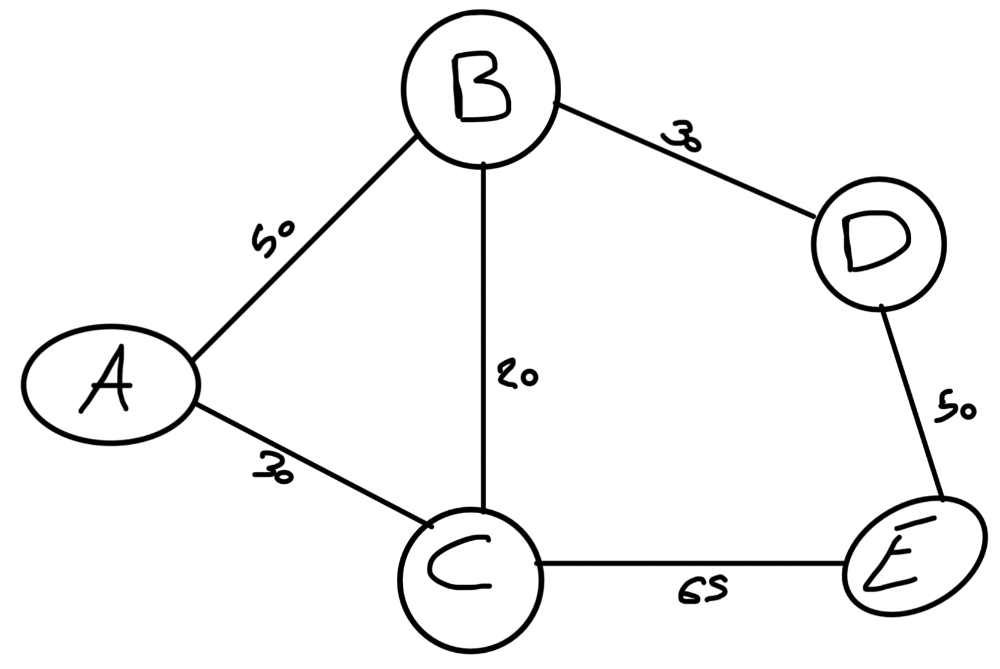
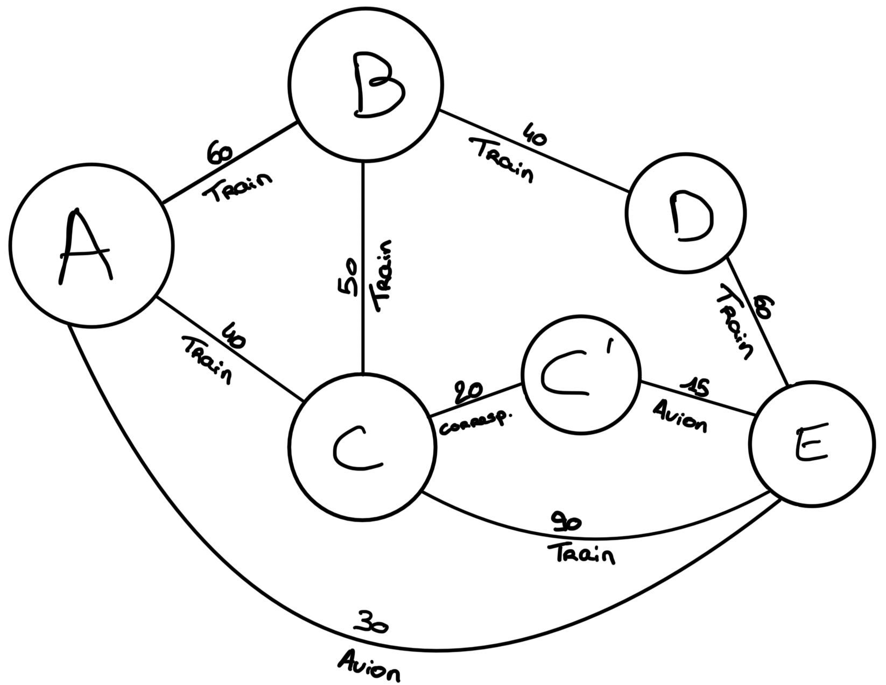

Votre rapport doit suivre le plan donné dans ce document.

Contraintes à respecter pour le rapport

- [ ] format: Markdown qu'on peut lire sur gitlab, ou pdf, ou html
- [ ] rapport dans un répertoire `graphes` à la racine du dépôt git
- [ ] rapport prêt le 21/06/2024; aucun délai supplémentaire ne sera accordé quelle que soit la raison donnée. Concrètement, on va récupérer la dernier daté au plus tard le 21/06/2024 et on ne verra même pas de version ultérieure du rapport, si elles existent. Minuit et une minute du 22/06/2024 sera trop tard
- [ ] respecte le plan donné ci-dessous
- [ ] garder les explications *en italique* jusque la fin pour s'y référer en écrivant le rapport
- [ ] supprimer les explications *en italique* juste avant de rendre la version finale du rapport
- [ ] le rapport est un texte **rédigé** avec des phrases intelligibles (on ne se contente pas de répondre laconiquement aux questions posées)

Idéalement, le rapport est rédigé au fur et à mesure avec le calendrier donné dans le sujet:

- section Version 1 faite avant le 18/05/2024 (1pt/20 si c'est le cas)
- section Version 2 faite avant le 08/06/2024 (1pt/20 si c'est le cas)

Finalement, l'utilisation d'un outils de génération de langage est autorisées, à condition de le faire intelligemment. En particulier, veillez à:
- avoir un rapport cohérent avec un style cohérent sur la totalité du document (niveau de langage, richesse du vocabulaire, termes utilisés, verbosité, ...)
- un rapport trop verbeux est fastidieux à lire. Si vous utilisez un outil pour faire du texte verbeux inutile, on utilisera un outil pour en faire un résumé et on corrigera uniquement le résumé
- les outils de génération insèrent parfois des phrases ne faisant pas partie du texte, mais qui s'adressent à l'interlocuteur (par exemple, pour vous informer que la limite de 2000 tokens est atteinte). La présence de telles phrases dans le rapport indique que vous n'avez pas relu et sera lourdement pénalisée.

**Début du rapport** Tout ce qui précède sera enlevé pour la version finale

------------------------------------------

SAE S2.02 -- Rapport pour la ressource Graphes
===

*LECOCQ, VANHOUTTE, Groupe E*

Version 1 : un seul moyen de transport
---

*Cette section traite uniquement de la Version 1 du projet.*

### Présentation d'un exemple

*Présenter un exemple concret de problème (données complètes pour la plateforme avec tous les moyens de transport, préférences de l'utilisatrices qui comprennent le moyen de transport choisi, le critère d'optimisation, et nombre d'itinéraires demandés).*
*Donner la solution du problème du point de vue de l'utilisatrice, càd quels sont les itinéraires possibles, quels sont les meilleurs itinéraires et pourquoi.*
*Pour l'instant on ne parle pas de graphes; on peut éventuellement faire des schémas.*

Lisa habite dans la ville A, aujourd'hui elle se rend chez sa grand-mère qui habite dans la ville E pour les vacances.   
La ville A et la ville D sont reliées par différents axes :
  - un axe ferroviaire de la ville A à la ville B, ayant un coût financier de 50 €, une durée de 60 minutes et un rejet de C02 de 1,7 kg CO2e.
  - un axe ferroviaire de la ville A à la ville C, ayant un coût financier de 30 €, une durée de 40 minutes et un rejet de CO2 de 1,4 kg CO2e.
  - un axe ferroviaire de la ville B à la ville C, ayant un coût financier de 20 €, une durée de 50 minutes et un rejet de CO2 de 1,4 kg CO2e.
  - un axe ferroviaire de la ville B à la ville D, ayant un coût financier de 30 €, une durée de 40 minutes et un rejet de CO2 de 2,4 kg CO2e.
  - un axe ferroviaire de la ville C à la ville E, ayant un coût financier de 65 €, une durée de 90 minutes et un rejet de CO2 de 1,2 kg CO2e.
  - un axe ferroviaire de la ville D à la ville E, ayant un coût financier de 50 €, une durée de 60 minutes et un rejet de CO2 de 1,3 kg CO2e.
  - un axe aérien de la ville A à la ville E, ayant un coût financier de 170 €, une durée de 30 minutes et un rejet de CO2 de 300 kg CO2e.  

Étant étudiante, Lisa possède un budget serré de 100 € pour ce voyage et cherche donc à minimiser le coût financier du transport, plutôt habitué avec ce moyen de transport, elle décide de prendre le train.  
Lisa souhaite pouvoir comparer les 3 trajets ayant le coût financier le plus faible et ne se déroulant qu'en train.  
Parmi l'ensemble des axes ferroviaires, les 3 meilleurs trajets basés sur les préférences de Lisa sont donc : 
  - ville A -> ville C -> ville E : 95€
  - ville A -> ville C -> ville B -> ville E : 130€
  - ville A -> ville B -> ville D -> ville E : 130€

En sachant que les deux derniers trajets dépassent le budget de Lisa, il ne lui reste plus qu'un trajet possible pour se rendre chez sa grand-mère.
Il faut donc qu'elle prenne le train de la villeA à villeC puis de la villeC à la villeE, pour un prix total de 95€.

### Modèle pour l'exemple

*Donner le graphe modélisant l'exemple ci-dessus.*
*Donner la solution du problème (càd les meilleurs itinéraires) en tant que chemins dans le graphe.*  

Dans le graphe, on ne modélise que les arêtes respectant les préférences de Lisa, on ne représente donc que les axes ferroviaires ainsi que leur prix.  
Les 3 plus courts chemins dans le graphe est le chemin [A, C, E] ayant un poids de 95, puis les chemins [A, C, B, E] et [A, B, D, E] ayant tous deux un poids de 130.

### Modélisation pour la Version 1 dans le cas général

*Expliquer de manière abstraite comment, étant donné un problème de recherche d'itinéraire (plateforme avec tous types de lignes, moyen de transport choisi, critère d'optimisation, nombre d'itinéraires demandés) on peut construire un graphe permettant de résoudre le problème de recherche d'itinéraire. C'est à dire:*
- *quels sont les sommets du graphe par rapport aux données du problème*, 
- *quelles sont ses arêtes, par rapport aux données du problème*, 
- *comment sont définis les poids des arêtes*,
- *quel algorithme sur les graphes permet de résoudre le problème d'itinéraire (nom de l'algorithme, arguments).*

*Utiliser un vocabulaire précis sur les graphes.*  

Basés sur les données du problème, les arêtes du graphe seront les différents lieux et les arêtes représenteront les différents axes reliant ces lieux.  
Le poids d'une arête sera définis en fonction des différents coûts de celle-ci (temps, prix, émissions...).
Les trajets optimaux pourront être déterminés grâce à l'algorithme de Dijkstra, qui prend en entrées un graphe valué G avec fonction de poids p et dont tous les poids sont positifs, ainsi qu'un point s0 dans G.

### Implémentation de la Version 1

*Écrire une classe de test qui reprend l'exemple, définit toutes les données de la plateforme, construit le graphe et calcule la solution.*
*Votre classe peut utiliser des assertions (test unitaire) ou bien afficher la solution.*
*Donner ici le **nom complet de la classe**, **la date et l'identifiant du commit à regarder** et un **lien vers la page de cette classe sur gitlab qui correspond au bon commit***.

*On insiste sur l'importance de spécifier le commit. En effet, quand vous commencerez la Version 2, le code utilisé pour le test de la Version 1 sera modifié. Il se peut que vous n'ayez pas le temps de finaliser la Version 2 et vous retrouver avec un code qui ne marche pas même pour la Version 1. C'est pourquoi il est important de rédiger le rapport au fur et à mesure et de donner ici un lien vers la version de votre code qui marche pour la Version 1 du projet.*

La classe de tests est la classe **GrapheTest.java**, le commit associé est le da82035a1871f36148d4633f7114320a378a6c75 datant du 17/05/2024, qui peut être retrouvée [ici](https://gitlab.univ-lille.fr/sae2.01-2.02/2024/E4/-/commit/da82035a1871f36148d4633f7114320a378a6c75#f5ee136bacd34139f138ee76916440a4c0c4519c).

Version 2 : multimodalité et prise en compte des correspondances
---

*Cette section explique la solution pour la Version 2 du projet.*

### Présentation d'un exemple

*Présenter un exemple concret (plateforme, couts de correspondance, critère d'optimalité).*
*Donner la solution du problème du point de vue de l'utilisatrice (quels sont les itinéraires possibles, lesquels sont optimaux et pourquoi).*
*Il est possible d'utiliser le même exemple que pour la Version 1 ou le modifier si pertinent.*

Lisa habite dans la ville A, aujourd'hui elle se rend chez sa grand-mère qui habite dans la ville E pour les vacances.   
La ville A et la ville E sont reliées par différents axes :
  - un axe ferroviaire de la ville A à la ville B, ayant un coût financier de 50 €, une durée de 60 minutes et un rejet de CO2 de 1,7 kg CO2e.  
  - un axe ferroviaire de la ville A à la ville C, ayant un coût financier de 30 €, une durée de 40 minutes et un rejet de CO2 de 1,4 kg CO2e.  
  - un axe ferroviaire de la ville B à la ville C, ayant un coût financier de 20 €, une durée de 50 minutes et un rejet de CO2 de 1,4 kg CO2e.  
  - un axe ferroviaire de la ville B à la ville D, ayant un coût financier de 30 €, une durée de 40 minutes et un rejet de CO2 de 2,4 kg CO2e.  
  - un axe ferroviaire de la ville C à la ville E, ayant un coût financier de 65 €, une durée de 90 minutes et un rejet de CO2 de 1,2 kg CO2e.  
  - un axe ferroviaire de la ville D à la ville E, ayant un coût financier de 50 €, une durée de 60 minutes et un rejet de CO2 de 1,3 kg CO2e.  
  - un axe aérien de la ville C à la ville E, ayant un coût financier de 100 €, une durée de 15 minutes et un rejet de CO2 de 150 kg CO2e.  
  - un axe aérien de la ville A à la ville E, ayant un coût financier de 170 €, une durée de 30 minutes et un rejet de CO2 de 300 kg CO2e.  

La correspondance entre la gare de la ville C et son aéroport se fait en Train, et à un coût financier de 60 €, une durée de 20 minutes et un rejet de 0,1 kg CO2e.  
Pas très ponctuelle, Lisa est partie est retard et doit être au plus vite chez sa grand-mère pour un repas de famille, qui débute dans 1 h 30.  
Lisa souhaite pouvoir comparer les trois trajets ayant la durée la plus faible.
D'après ses critères, les trois meilleurs trajets sont les suivants :
  - Ville A à Ville E en Avion → 30 minutes
  - ville A à ville C en train, correspondance, puis ville C à ville E en avion → 75 minutes
  - ville A à ville E en passant par ville C → 130 minutes

En sachant que le dernier trajet dépasse le temps limite de Lisa qui est de 1 h 30, il ne lui reste plus que deux trajets possibles pour se rendre chez sa grand-mère.  
Le trajet optimal étant la ligne aérienne reliant la ville A à la ville E, avec une durée de 30 minutes.  

### Modèle pour l'exemple

*Donner le graphe modélisant l'exemple ci-dessus.*
*Donner la solution du problème (càd les meilleurs itinéraires) en tant que chemins dans le graphe.*

  

Les trois plus courts chemins dans le graphe sont [A, E] avec un poids de 30, [A, C, C', E] avec un poids de 75 puis [A, C, E] avec un poids de 130.  

### Modélisation pour la Version 2 dans le cas général

*Mêmes questions que pour la section correspondante de la Version 1, mais cette fois-ci les données d'entrée contiennent aussi des couts de correspondance.*
*Vous pouvez expliquer l'entièreté de la solution pour la Version 2, ou bien indiquer **clairement** les différences par rapport à la solution proposée pour la Version 1.*

Le graphe de la version 2 est structuré de la même façon que celui de la version 1, les sommets représentent les villes tandis que les arêtes représentent les axes reliant ces villes.
Les villes peuvent cependant être représentées plusieurs fois, avec des arêtes entre chacune d'entre elles, cela modélise les correspondances possibles s'il y a changement de modalité de transport au sein de cette même ville.  

### Implémentation de la Version 2

*Écrire une classe de test qui reprend l'exemple, définit toutes les données de la plateforme, construit le graphe et calcule la solution.*
*Votre classe peut utiliser des assertions (test unitaire) ou bien afficher la solution.*
*Donner ici le **nom complet de la classe**, **la date et l'identifiant du commit à regarder** et un **lien vers la page de cette classe sur gitlab qui correspond au bon commit***.
*En particulier, il peut s'agir de la même classe que celle donnée pour la Version 1, mais un commit différent.*

La classe de tests est la même classe que lors de la version 1, c'est-à-dire la classe **GrapheTest.java**, le commit associé est le e4082a1fdef6d17df2a22702615d72aeb5afe446 datant du 7/06/2024, qui peut être retrouvée [ici](https://gitlab.univ-lille.fr/sae2.01-2.02/2024/E4/-/blob/main/graphes/GrapheTest.java?ref_type=heads).

Version 3 : optimisation multi-critères
---

*Suivre le même plan que pour les deux autres sections.*
*Pour l'exemple, veillez à spécifier toutes les données des problèmes. En particulier, on ajoute ici l'expression des préférences d'optimisation de l'utilisatrice.*
*Comme précédemment, il est possible d'utiliser le même exemple et simplement l'enrichir.*

----------------------------------------------------

**Fin du rapport**

### Barème sur 30 pts

Toute question sur le barème est à adresser à iovka.boneva@univ-lille.fr

- Rapport non rendu à temps -> note 0 
- **(7, décomposé comme suit)** Divers
  - **(1,5)** Respect de la structure du rapport
  - **(1,5)** Section Version 1 rendue pour le 18/05/2024. Cette version peut contenir les parties en italique.
  - **(1,5)** Section Version 2 rendue pour le 08/06/2024. Cette version peut contenir les parties en italique.
  - **(1)** Utilisation de vocabulaire précis sur les graphes (termes vu en cours, noms des algorithmes, etc.)
  - **(1,5)** Style d'écriture fluide et compréhensible

- **(8, décomposé comme suit)** Solution pour la Version 1
  - **(2)** Exemple pertinent (illustre tous les aspects du problème) et lisible (en particulier, ni trop grand ni trop petit, bien présenté)
  - **(4)** Le modèle de l'exemple permet de trouver la solution sur l'exemple. La modélisation pour le cas général permet de résoudre le problème posé
  - **(2)** L'implémentation de l'exemple est correcte et fonctionnelle

- **(6, décomposé comme suit)** Solution pour la Version 2
  - **(1)** Exemple pertinent
  - **(4)** le modèle de l'exemple permet de trouver la solution sur l'exemple. La modélisation pour le cas général permet de résoudre le problème posé
  - **(1)** L'implémentation de l'exemple est correcte et fonctionnelle

- **(3)** Qualité de la description de la solution (concerne les sections "Modèlisation dans le cas général" pour les Versions 1 et 2):
  - La modélisation pour le cas général est décrite de manière abstraite mais précise et complète. Pour vous donner une idée, un·e étudiant·e de BUT qui a validé les ressources Graphes et Dev devrait être en mesure d'implémenter votre solution d'après la description que vous en faites, sans avoir à trop réfléchir.

- **(6)** Solution pour la Version 3: mêmes critères que pour la Version 2